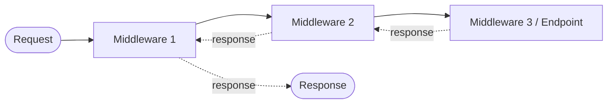

# ASP.NET Core Middleware Notes

> Learning notes on the ASP.NET Core request pipeline: concepts, built-in methods, custom middleware, and best practices.
> Targets **.NET 6+** (minimal hosting model in `Program.cs`). Older `Startup.cs` differences are noted where relevant.

## Table of Contents
- [1. Introduction](#1-introduction)
- [2. How the Pipeline Works](#2-how-the-pipeline-works)
- [3. Middleware Execution Order](#3-middleware-execution-order)
- [4. Pipeline Methods: Use, Run, Map, UseWhen, MapWhen](#4-pipeline-methods-use-run-map-usewhen-mapwhen)
- [5. Routing: UseRouting and UseEndpoints](#5-routing-userouting-and-useendpoints)
- [6. Creating Custom Middleware](#6-creating-custom-middleware)
- [7. Configuring Middleware](#7-configuring-middleware)
- [8. Built-in Middleware Reference](#8-built-in-middleware-reference)
- [9. Best Practices and Common Pitfalls](#9-best-practices-and-common-pitfalls)
- [10. Quick Reference Cheat Sheet](#10-quick-reference-cheat-sheet)
- [11. Further Reading](#11-further-reading)

---

## 1. Introduction

Middleware is a software component that sits in the HTTP request pipeline. Each component can:

- Inspect or modify the incoming `HttpRequest`
- Call the next component in the pipeline (or **short-circuit** and respond immediately)
- Inspect or modify the outgoing `HttpResponse` after the next component finishes

Typical uses: authentication, authorization, logging, error handling, CORS, caching, compression, routing.

---

## 2. How the Pipeline Works

Think of the pipeline as nested layers (an onion). A request travels **inward** through each component, and the response travels back **outward** in reverse order.



Code before `await next(context)` runs on the way **in**; code after it runs on the way **out**.

---

## 3. Middleware Execution Order

Components run in the **exact order they are registered**. Order is critical: for example, authentication must run before authorization, and exception handling should wrap everything else.

### Recommended order (from Microsoft docs)

```csharp
var app = builder.Build();

app.UseExceptionHandler("/error");   // 1. Catch exceptions from everything below
app.UseHsts();                       // 2. HTTPS Strict Transport Security
app.UseHttpsRedirection();           // 3. Redirect HTTP -> HTTPS
app.UseStaticFiles();                // 4. Serve static files (short-circuits early)
app.UseRouting();                    // 5. Match request to an endpoint
app.UseCors();                       // 6. CORS (after routing, before auth)
app.UseAuthentication();             // 7. Who are you?
app.UseAuthorization();              // 8. Are you allowed?
app.UseResponseCaching();            // 9. Caching (after CORS)
app.MapControllers();                // 10. Execute the endpoint

app.Run();
```

> **Tip:** If a middleware behaves strangely, check its position first. Most pipeline bugs are ordering bugs.

---

## 4. Pipeline Methods: Use, Run, Map, UseWhen, MapWhen

| Method | Purpose | Calls next? | Rejoins main pipeline? |
|---|---|---|---|
| `Use` | Add middleware that can pass control onward | Yes (optional) | n/a |
| `Run` | Add **terminal** middleware | No | n/a |
| `Map` | Branch by **path prefix** | Branch only | No |
| `MapWhen` | Branch by **predicate** | Branch only | No |
| `UseWhen` | Conditionally apply middleware by predicate | Yes | **Yes** |

### `Use`: inline middleware that can continue the pipeline

```csharp
app.Use(async (context, next) =>
{
    // Pre-processing (request on the way in)
    Console.WriteLine($"Request: {context.Request.Method} {context.Request.Path}");

    await next(context);          // or: await next();

    // Post-processing (response on the way out)
    Console.WriteLine($"Response: {context.Response.StatusCode}");
});
```

### `Run`: terminal middleware

Ends the pipeline. Nothing registered after it will execute for that request.

```csharp
app.Run(async context =>
{
    await context.Response.WriteAsync("Hello, World!");
});
```

### `Map`: branch by path prefix

The branch **does not rejoin** the main pipeline. The matched prefix is removed from `Path` and moved to `PathBase` inside the branch.

```csharp
app.Map("/admin", adminApp =>
{
    adminApp.Use(async (context, next) =>
    {
        // Only runs for /admin/*
        await next(context);
    });

    adminApp.Run(async context =>
        await context.Response.WriteAsync("Admin area"));
});
```

### `MapWhen`: branch by predicate (does not rejoin)

```csharp
app.MapWhen(
    context => context.Request.Query.ContainsKey("debug"),
    debugApp => debugApp.Run(async ctx =>
        await ctx.Response.WriteAsync("Debug branch")));
```

### `UseWhen`: conditional middleware that **rejoins** the main pipeline

> Note: the original notes called this `When`. The actual method name is `UseWhen`.

```csharp
app.UseWhen(
    context => context.Request.Path.StartsWithSegments("/api"),
    apiApp => apiApp.UseMiddleware<ApiKeyMiddleware>());
```

---

## 5. Routing: UseRouting and UseEndpoints

- **`UseRouting()`** matches the request to an endpoint (controller action, Razor Page, minimal API, etc.). Place it early, **before** anything that needs to know the matched endpoint (CORS, auth).
- **`UseEndpoints()`** executes the matched endpoint. It goes **after** authentication/authorization.

```csharp
app.UseRouting();
app.UseAuthentication();
app.UseAuthorization();

app.UseEndpoints(endpoints =>
{
    endpoints.MapControllers();
    endpoints.MapGet("/health", () => "OK");
});
```

> **.NET 6+ note:** With the minimal hosting model, routing is added implicitly. You can call `app.MapControllers()` / `app.MapGet(...)` directly without explicit `UseRouting()` / `UseEndpoints()`. You only call `UseRouting()` explicitly when you need to control where it sits relative to other middleware.

---

## 6. Creating Custom Middleware

There are two approaches.

### Option A: Convention-based middleware (most common)

Requirements:
1. A constructor that accepts `RequestDelegate next` (plus any singleton-safe dependencies)
2. A public method named `Invoke` or `InvokeAsync` returning `Task`, with `HttpContext` as the first parameter

```csharp
public class RequestTimingMiddleware
{
    private readonly RequestDelegate _next;
    private readonly ILogger<RequestTimingMiddleware> _logger;

    public RequestTimingMiddleware(RequestDelegate next, ILogger<RequestTimingMiddleware> logger)
    {
        _next = next;
        _logger = logger;
    }

    // Scoped services (e.g., DbContext) can be injected here as extra parameters
    public async Task InvokeAsync(HttpContext context)
    {
        var sw = Stopwatch.StartNew();

        await _next(context);

        sw.Stop();
        _logger.LogInformation("{Method} {Path} took {Ms} ms",
            context.Request.Method, context.Request.Path, sw.ElapsedMilliseconds);
    }
}
```

Register it:

```csharp
app.UseMiddleware<RequestTimingMiddleware>();
```

> **Lifetime:** Convention-based middleware is constructed **once** (singleton-like). Inject **scoped** services as parameters of `InvokeAsync`, not the constructor.

### Option B: Factory-based middleware (`IMiddleware`)

Implements the `IMiddleware` interface (note: there is **no** generic `IMiddleware<T>`). It is resolved from DI **per request**, so it supports scoped/transient dependencies in the constructor.

```csharp
public class ApiKeyMiddleware : IMiddleware
{
    public async Task InvokeAsync(HttpContext context, RequestDelegate next)
    {
        if (!context.Request.Headers.TryGetValue("X-Api-Key", out var key) || key != "secret")
        {
            context.Response.StatusCode = StatusCodes.Status401Unauthorized;
            await context.Response.WriteAsync("Missing or invalid API key");
            return;                       // short-circuit: do NOT call next
        }

        await next(context);
    }
}
```

You **must** register it in DI **and** add it to the pipeline:

```csharp
builder.Services.AddTransient<ApiKeyMiddleware>();   // required
// ...
app.UseMiddleware<ApiKeyMiddleware>();
```

### Convention vs. factory at a glance

| | Convention-based | `IMiddleware` |
|---|---|---|
| Interface | None (by convention) | `IMiddleware` |
| Method | `Invoke` / `InvokeAsync(HttpContext, ...)` | `InvokeAsync(HttpContext, RequestDelegate)` |
| Instantiated | Once, at startup | Per request, from DI |
| DI registration needed | No | **Yes** |
| Scoped deps in constructor | No (use method params) | Yes |

### Tidy extension method (optional but idiomatic)

```csharp
public static class RequestTimingMiddlewareExtensions
{
    public static IApplicationBuilder UseRequestTiming(this IApplicationBuilder app)
        => app.UseMiddleware<RequestTimingMiddleware>();
}

// Usage
app.UseRequestTiming();
```

### Example: global exception handling middleware

```csharp
public class ExceptionHandlingMiddleware
{
    private readonly RequestDelegate _next;
    private readonly ILogger<ExceptionHandlingMiddleware> _logger;

    public ExceptionHandlingMiddleware(RequestDelegate next, ILogger<ExceptionHandlingMiddleware> logger)
        => (_next, _logger) = (next, logger);

    public async Task InvokeAsync(HttpContext context)
    {
        try
        {
            await _next(context);
        }
        catch (Exception ex)
        {
            _logger.LogError(ex, "Unhandled exception");
            context.Response.StatusCode = StatusCodes.Status500InternalServerError;
            await context.Response.WriteAsJsonAsync(new { error = "An unexpected error occurred." });
        }
    }
}
```

Register it **first** so it wraps the rest of the pipeline.

---

## 7. Configuring Middleware

### .NET 6+ (`Program.cs`)

```csharp
var builder = WebApplication.CreateBuilder(args);
builder.Services.AddControllers();

var app = builder.Build();

if (app.Environment.IsDevelopment())
    app.UseDeveloperExceptionPage();
else
    app.UseExceptionHandler("/error");

app.UseMiddleware<RequestTimingMiddleware>();
app.MapControllers();
app.Run();
```

### Pre-.NET 6 (`Startup.cs`)

```csharp
public void Configure(IApplicationBuilder app, IWebHostEnvironment env)
{
    if (env.IsDevelopment())
        app.UseDeveloperExceptionPage();

    app.UseMiddleware<RequestTimingMiddleware>();
    app.UseRouting();
    app.UseEndpoints(e => e.MapControllers());
}
```

### Conditional inclusion

Based on environment:

```csharp
if (app.Environment.IsProduction())
    app.UseHsts();
```

Based on configuration:

```csharp
if (app.Configuration.GetValue<bool>("Features:EnableTiming"))
    app.UseMiddleware<RequestTimingMiddleware>();
```

Based on the request: use `UseWhen` (see [section 4](#4-pipeline-methods-use-run-map-usewhen-mapwhen)).

### Passing options to middleware

```csharp
public class GreetingOptions { public string Message { get; set; } = "Hello"; }

builder.Services.Configure<GreetingOptions>(builder.Configuration.GetSection("Greeting"));

// In the middleware constructor:
public GreetingMiddleware(RequestDelegate next, IOptions<GreetingOptions> options) { ... }
```

---

## 8. Built-in Middleware Reference

Most common problems are already solved by built-in middleware. Prefer these over writing your own.

| Concern | Middleware | Notes |
|---|---|---|
| Error handling | `UseExceptionHandler`, `UseDeveloperExceptionPage`, `UseStatusCodePages` | Register first |
| HTTPS | `UseHttpsRedirection`, `UseHsts` | Production: HSTS |
| Static files | `UseStaticFiles`, `UseDefaultFiles` | Short-circuits when a file matches |
| Routing | `UseRouting` | Before CORS/auth |
| CORS | `UseCors` | After routing, before auth |
| Authentication | `UseAuthentication` | JWT, cookies, OAuth, OpenID Connect, etc. |
| Authorization | `UseAuthorization` | After authentication |
| Logging | `UseHttpLogging` | Logs request/response details |
| Caching | `UseResponseCaching`, `UseOutputCache` (.NET 7+) | |
| Compression | `UseResponseCompression` | Gzip / Brotli |
| Rate limiting | `UseRateLimiter` (.NET 7+) | |
| Forwarded headers | `UseForwardedHeaders` | Behind proxies / load balancers |
| Session | `UseSession` | Needs `AddSession()` |
| Health checks | `MapHealthChecks` | Endpoint-based |

Third-party: **Serilog** request logging (`UseSerilogRequestLogging`), **Polly** (resilience, typically via `HttpClient`), **IdentityServer / Duende** (identity provider).

---

## 9. Best Practices and Common Pitfalls

**Do**
- Register exception handling **first**.
- Keep each middleware focused on **one responsibility**.
- Always `await next(context)` unless you intentionally short-circuit.
- Use `async`/`await` throughout. Never block with `.Result` or `.Wait()`.
- Use extension methods (`UseXyz`) to keep `Program.cs` readable.
- Inject scoped services via `InvokeAsync` parameters.

**Don't**
- Don't write to the response body and then call `next`. Once the response has started, headers cannot be changed. Check `context.Response.HasStarted` if unsure.
- Don't call `next` more than once.
- Don't store per-request state in middleware fields. Middleware instances are shared across requests, so use `HttpContext.Items` instead.
- Don't forget to register `IMiddleware` implementations in DI.
- Don't place `UseAuthorization` before `UseAuthentication`.

**Debugging tips**
- Add a temporary logging middleware at the start and end of the pipeline to see where requests stop.
- If an endpoint returns 404 unexpectedly, check for a `Run` or short-circuiting middleware registered earlier.

---

## 10. Quick Reference Cheat Sheet

```csharp
// Inline, can continue
app.Use(async (ctx, next) => { /* before */ await next(ctx); /* after */ });

// Terminal
app.Run(async ctx => await ctx.Response.WriteAsync("done"));

// Branch by path (no rejoin)
app.Map("/admin", branch => branch.Run(async ctx => await ctx.Response.WriteAsync("admin")));

// Branch by predicate (no rejoin)
app.MapWhen(ctx => ctx.Request.IsHttps, branch => { /* ... */ });

// Conditional, rejoins main pipeline
app.UseWhen(ctx => ctx.Request.Path.StartsWithSegments("/api"), branch => branch.UseMiddleware<MyMiddleware>());

// Class-based
app.UseMiddleware<MyMiddleware>();
```

| Question | Answer |
|---|---|
| Which method ends the pipeline? | `Run` |
| Which branches never rejoin? | `Map`, `MapWhen` |
| Which conditional method rejoins? | `UseWhen` |
| Convention method name? | `Invoke` or `InvokeAsync` |
| Interface for DI-per-request middleware? | `IMiddleware` (needs DI registration) |
| Where do scoped services go? | `InvokeAsync` parameters |

---

## 11. Further Reading

- [ASP.NET Core Middleware (Microsoft Learn)](https://learn.microsoft.com/aspnet/core/fundamentals/middleware/)
- [Write custom ASP.NET Core middleware](https://learn.microsoft.com/aspnet/core/fundamentals/middleware/write)
- [Factory-based middleware activation](https://learn.microsoft.com/aspnet/core/fundamentals/middleware/extensibility)
- [Routing in ASP.NET Core](https://learn.microsoft.com/aspnet/core/fundamentals/routing)
